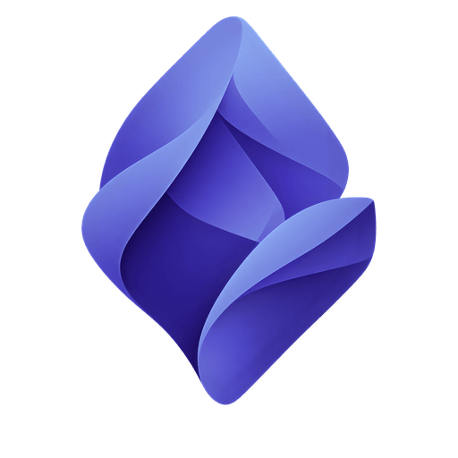
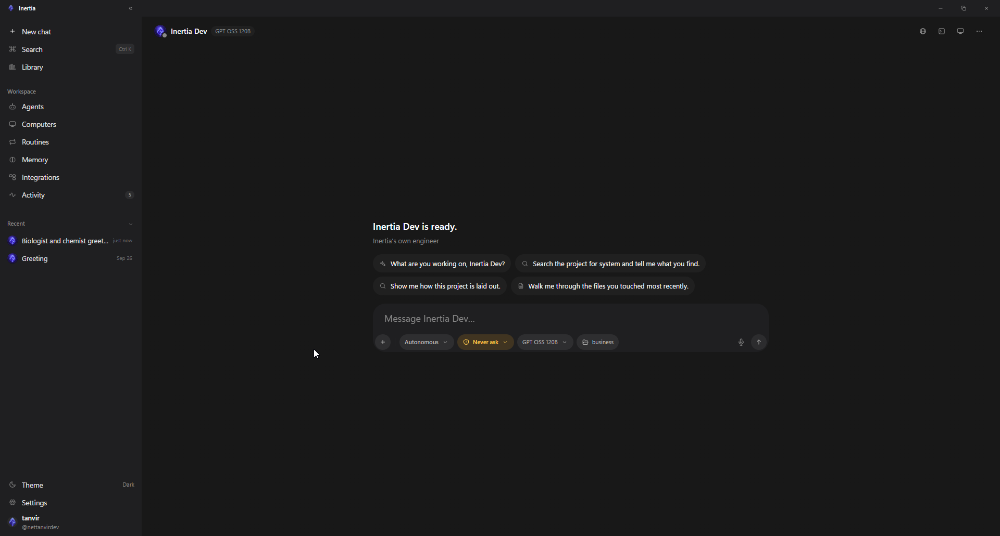

<p align="center">
  
</p>

<h1 align="center">inertia-ai</h1>

<p align="center">A desktop workspace for AI agents: chat, tools, sandboxes, routines and memory.</p>

<p align="center">
  <a href="https://github.com/nettanvirdev/inertia/actions/workflows/ci.yml"></a>
  <a href="https://github.com/nettanvirdev/inertia/releases/latest"></a>
  <a href="LICENSE"></a>
  
</p>

inertia-ai (the app itself is called Inertia) is a desktop app for working with AI agents on your own machine. You
chat with agents that can read and edit your files, run commands, drive a
browser, delegate to sub-agents, use tools from MCP servers and APIs, and work
on sandboxed computers with a desktop you can watch. Everything it knows
(conversations, agents, routines, memories, settings) is plain files in a
folder you choose. You bring your own model provider and API keys; there is no
Inertia account or server.

Built with [Tauri 2](https://tauri.app) (Rust) and React.



> inertia-ai is not related to [Inertia.js](https://inertiajs.com).

## Features

- **Chat with agents** in four modes: Chat (no changes), Plan (ends with a
  plan you approve), Autonomous (full tools), and Agent Group (several agents
  in one conversation).
- **Any model provider**: Anthropic natively, and anything that speaks the
  OpenAI chat-completions API (OpenAI, OpenRouter, Groq, Together, DeepSeek,
  xAI, Ollama, local servers, gateways).
- **Built-in tools**: read, write, edit and patch files; search; a shell with
  background processes; git worktrees; a task list; language-server queries;
  per-turn snapshots with diff and undo. See [docs/tools.md](docs/tools.md).
- **Permissions you control**: allow/ask/deny rules per tool and per command
  or path, workspace-wide or per agent, and an approval card showing the
  exact command or path for everything else.
- **Agents and sub-agents**: agents with their own instructions, model,
  working folder and permissions; blocking `task` delegation and a background
  crew that works in parallel.
- **Integrations**: MCP servers (stdio and HTTP), OpenAPI specs as tools,
  Composio apps, and Claude Code-compatible lifecycle hooks.
- **Routines**: scheduled or one-off runs (cron, interval, one time) that run
  unattended while the app is running.
- **Memory and skills**: durable facts carried between conversations, global
  or per project; skills as folders of instructions loaded on demand.
- **Computers**: Docker or Daytona sandboxes with a desktop the agent can see
  and drive and you can watch live (noVNC), or a local folder.
- **Terminal and browser panes** beside the conversation. The agent can read
  your terminal and drive the browser pane, with permission.
- **Voice** input and spoken replies through ElevenLabs.

## Platform status

| Platform | Status |
|---|---|
| Windows 10/11 | Supported. Developed and tested here; installer provided. |
| macOS, Linux | The code is cross-platform and builds are expected to work, but they are untested. |

## Quick start

### Use it

1. Download `Inertia-Setup-<version>.exe` from
   [Releases](https://github.com/nettanvirdev/inertia/releases) and run it.
   Builds are not code-signed yet, so SmartScreen will warn: **More info > Run
   anyway**.
2. Choose a workspace folder (the default is `Documents/Inertia`).
3. In **Settings > Providers**, add a provider and paste your API key.
4. Start a conversation.

Full walkthrough: [docs/getting-started.md](docs/getting-started.md).

### Build it

Prerequisites: Rust (1.85+), [Bun](https://bun.sh), Node.js, and Tauri's
platform dependencies. Details in [docs/development.md](docs/development.md).

```bash
git clone https://github.com/nettanvirdev/inertia.git
cd inertia
bun install
bun run tauri dev          # run in development
bun run tauri build        # release build and installer
```

Tests:

```bash
bun run lint && bun run test && bun run build
cargo test --workspace --manifest-path src-tauri/Cargo.toml
```

## Documentation

| | |
|---|---|
| [Getting started](docs/getting-started.md) | Install, first run, providers, first chat |
| [Tools](docs/tools.md) | Every built-in tool, and how permissions work |
| [Agents and routines](docs/agents-and-routines.md) | Agents, sub-agents, group chats, skills, memory, routines |
| [Integrations](docs/integrations.md) | MCP servers, OpenAPI, Composio, hooks |
| [Computers](docs/computers.md) | Docker, Daytona and local machines, the live desktop |
| [Workspace](docs/workspace.md) | The workspace folder, file formats, backup and restore |
| [Security](docs/security.md) | The security model, what leaves your machine, and its limits |
| [Development](docs/development.md) | Building, testing, the devkit, the Windows setup |
| [Architecture](docs/architecture.md) | Crates, the command surface, how a turn runs |
| [Backend API](docs/backend-api.md) | Commands, events, and the frontend bridge |
| [Releasing](docs/releasing.md) | Version bumps and the release checklist |
| [Third-party licenses](docs/third-party-licenses.md) | Dependency and font licenses |
| [Changelog](CHANGELOG.md) | What changed in each release |

## Security and privacy

Inertia has no telemetry and no account; it talks only to the providers and
services you configure. Two things to know up front:

- **API keys are stored in plain text** in `<workspace>/secrets/secrets.json`.
  Keep the workspace folder private.
- **Approved shell commands run with your privileges.** The permission system
  decides what runs; it does not sandbox it. Use a Docker or Daytona computer
  for untrusted work.

Read [docs/security.md](docs/security.md). To report a vulnerability, see
[SECURITY.md](SECURITY.md).

## Contributing

Contributions are welcome. See [CONTRIBUTING.md](CONTRIBUTING.md) and the
[Code of Conduct](CODE_OF_CONDUCT.md).

## License

[MIT](LICENSE) © Tanvir Ahamed

Third-party components are listed in
[THIRD_PARTY_NOTICES.md](THIRD_PARTY_NOTICES.md).
